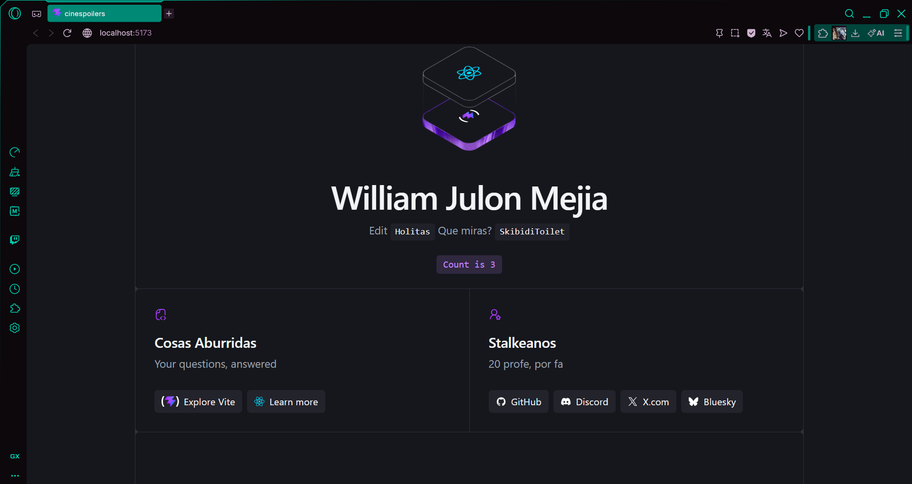

# William Julon Mejia - Lab 09

## Captura de la terminal creando el proyecto

## Proyecto levantado

## Landing page React Editada

## App Limpia

## MI PRIMERA VEZ creando componentes

# Angel Gabriel Llanos Pacheco

## Instalación de React

## Despliegue de React

## React Editada

## App Limpia

## Primer Componente

## Alex Sanabria

### 1. Creación del proyecto

### 2. Proyecto levantado

### 3. Landing editada

### 4. Proyecto limpio

---