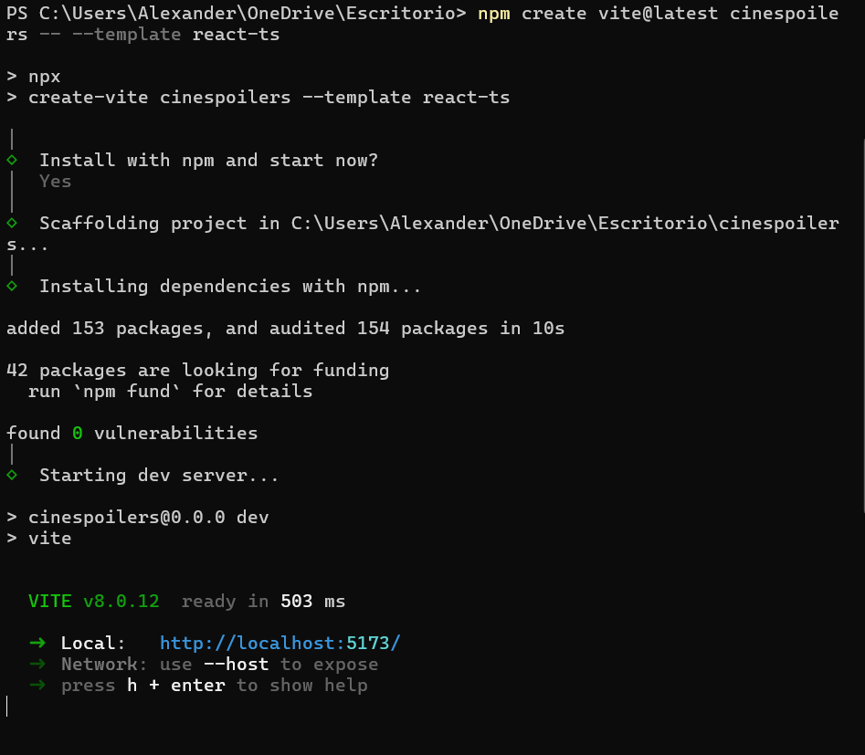
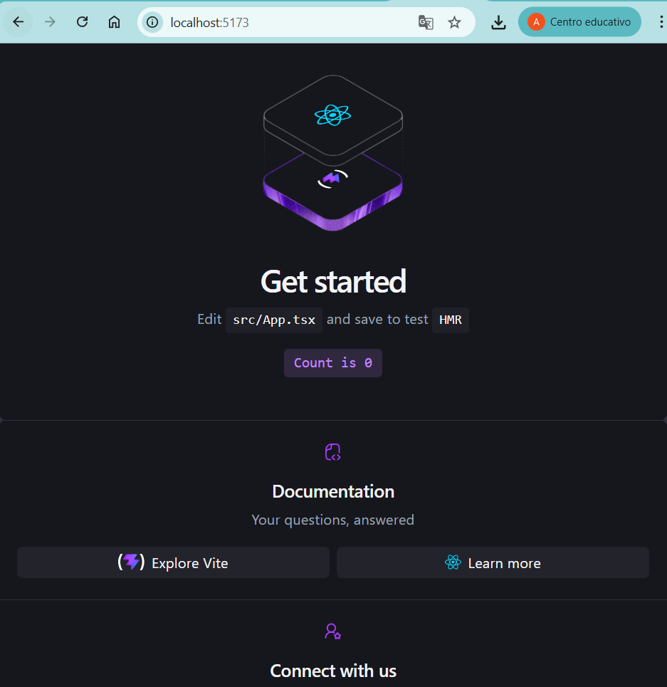
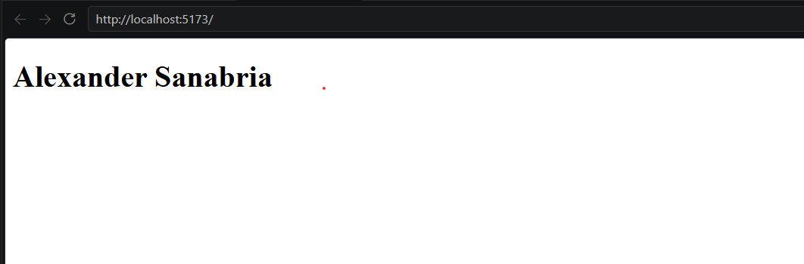
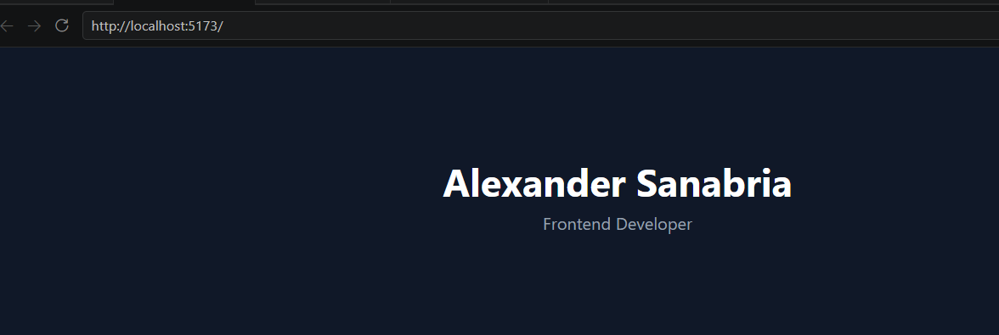

# 🎬 CineSpoilerS

E-commerce de spoilers de películas construido con React + TypeScript + Vite.

**Desarrollado por:** Alexander Sanabria — Frontend Developer

---

## 🚀 Stack Tecnológico

- **React 19** + **TypeScript**
- **Vite 8** — bundler ultrarrápido
- **Tailwind CSS** — estilos utility-first
- **Zustand** — estado global
- **Stripe** — pasarela de pagos
- **React Router** — navegación
- **Lucide React** — íconos
- **React Hot Toast** — notificaciones

---

## 📸 Capturas del proceso

### 1. Creación del proyecto


### 2. Proyecto levantado


### 3. Landing editada


### 4. Proyecto limpio


---

## 🛠️ Instalación

```bash
git clone https://github.com/alexandersanabria-lang/cine-spoilers.git
cd cine-spoilers
npm install
npm run dev
```

---

## 📁 Estructura del proyecto